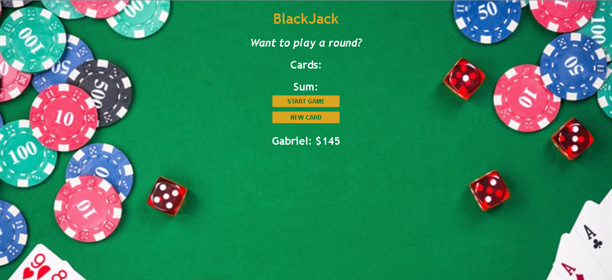

# BlackJack

> Jogo simples de blackjack feito com javascript 

## ☕ Usando BlackJack

Para usar BlackJack, clique no link abaixo:

[![Abrir com Netlifly]](https://blackjack-game-basic.netlify.app/)

## 🤝 Colaborador

Agradecemos à seguinte pessoa que contribuíu para este projeto:

<table>
  <tr>
    <td align="center">
      <a href="https://github.com/gabomoreira">
         
        
          <b>Gabriel Moreira</b>
        
      </a>
    </td>
  </tr>
</table>
